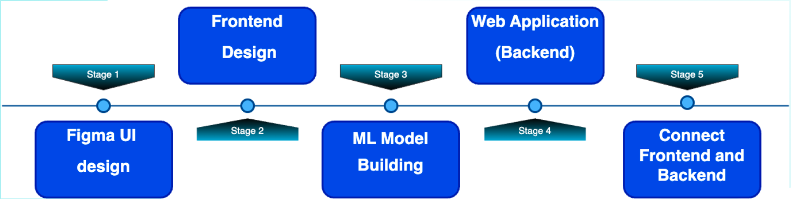
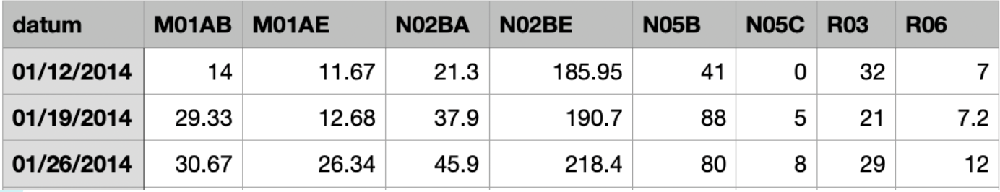

# Pharama-sales-prediction

#### **Introduction**

---

* **Background of the problem**

    Pharmacists and drug sellers in Sri Lanka face many challenges due to issues likeweather, importing difficulties, andeconomic problems. This often leads to a shortage of medicines when  people need them most. To help, we want to create a data science system that predicts these issues, so sellers can better prepare and reduce shortage.

#### Design 

---

#### Implementation

---

**Technologies**

* Frontend development - HTML,CSS and Flask render templates
* Backend development - Python,Pandas,Matplotlib,adfuller,Flask

**Data collection and pre-processing**

* We gathered data from two pharmacies in particular area.
* Then categorize those data according to ATC classification system managed by WHO (e.g., acetaminophen belongs to ATC code -N02BE01).

  
* We will process the dataset by handling null values, addressing missing data, and managing outliers accordingly.

**Model Implementation**

* Reason for use time series forecasting:
  	
* We split entire dataset into Train and Test data.
