# Data Preprocessing Pipeline

Use this compact version under the preprocessing paragraph in the thesis.

```mermaid
flowchart LR
    rawFiles[/"Category CSV files C1-C8"/]
    readCsv["Read CSV files"]
    parseDates["Parse datum values"]
    timeIndex["Set time index"]
    cleanData["Clean usable records"]
    targetSales["Select sales target"]
    preparedData["Prepared time-series dataset"]
    modelInput["Model training input"]

    rawFiles --> readCsv
    readCsv --> parseDates
    parseDates --> timeIndex
    timeIndex --> cleanData
    cleanData --> targetSales
    targetSales --> preparedData
    preparedData --> modelInput

    style rawFiles fill:#C2E5FF,stroke:#3DADFF
    style preparedData fill:#CDF4D3,stroke:#66D575
    style modelInput fill:#FFECBD,stroke:#FFC943
```

Suggested figure caption:

**Figure X.X: Data preprocessing pipeline used to prepare category-wise pharmaceutical sales records for model training.**

This compact diagram represents the project preprocessing flow from category-wise CSV files to a prepared time-series dataset. Model-specific transformations such as lag features, scaling, and sequence windows can be explained in the following model development section if needed.
